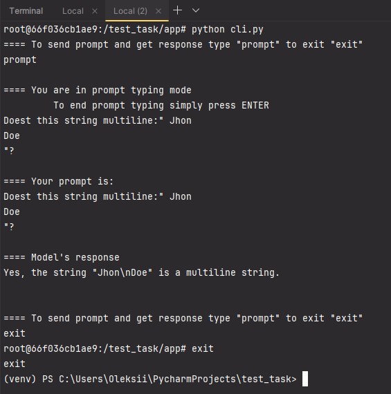

# Test task
## Approach
To complete the given task I used `FastApi` framework to create a simple service, consisting 
of one endpoint, which accepts user prompt and returns `OpenAI` response.

To actually access `OpenAI` I used `LangChain` framework. In my code, I create an instance of 
`ChatOpenAI()` class to interact with the `OpenAI`'s `GPT-3.5 Turbo` model. This instance allowed 
me to send user's prompts, and stream model's responses.

## Choice of frameworks
To complete this task I was given the opportunity to choose from the great variety of frameworks for
service realization and llm access realization, yet I chose `FastApi` and `Langchain`. Here is brief
explanation why I chose them:
* `FastApi` is a modern, fast, web framework for building APIs with python. What I liked in `FastApi` the 
most is its usage of new python features. `FastApi` provides support of type hints and models for automatic 
validation and documentation, thus giving great editor support and fewer bugs in development. `FastApi` is
also easy to learn.
* To access `OpenAI` I had a choice between `LangChain` and `LlamaIndex` frameworks. I chose `LangChain`
because of its flexibility in interactions with llms. `LangChain` provides various tools to create
flexible access to llms through prompt chains, prompt templates etc. While `LlamaIndex`  is specifically 
designed for building search and retrieval applications powered by large language models. It simplifies 
the process of querying LLMs and retrieving relevant documents based on the user's input. In sum, I think
that `LlamaIndex` fits better for data retrieval, while `LangChain` fits better for access to llms through
constructed prompts. In the given task my primary objective wasn't to build data retrieval system, but
to just send prompt and get response from `OpenAI`, that's why my framework of choice was `LangChain`.

## How to run the code
* First, you need to build a Docker image. Make sure you are in the same folder where the Dockerfile is located:
    ```
        docker build -t gorch_img .
    ```
* Next, run a Docker container using:
    ```
        docker run -d --name gorch_cont -p 8000:8000 gorch_img
    ```
* To access a script that allows multiline prompt sending, run an interactive shell inside the container:
    ```
       docker exec -it gorch_cont bash 
    ```
* After that, navigate to the script by typing:
    ```
       cd app 
    ```
* Run the script using:
    ```
       python cli.py
    ```
* Follow the instructions provided by the script.
* To exit the interactive shell, type:
    ```
       exit
    ```

## Script usage example
Here is an example of script usage:


